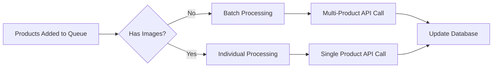

# AI Processing Queue System

## Overview

The AI Processing Queue system is designed to handle bulk product processing efficiently while respecting OpenAI's rate limits and optimizing for both RPM (requests per minute) and TPM (tokens per minute).

## Key Features

### 🚀 **Smart Batch Processing**
- **Multi-Product Requests**: Products without images are processed in batches (up to 5 products per API call)
- **Individual Processing**: Products with images are processed individually to maintain image analysis quality
- **Optimal Batch Sizing**: Automatically calculates optimal batch sizes based on token estimation

### 📊 **Rate Limit Management**
- **Conservative Limits**: Uses 500 requests per minute (10% safety margin under OpenAI's 5,000 RPM limit)
- **Token Awareness**: Respects 450,000 TPM limit with intelligent token estimation
- **Batch Delays**: 1-minute delays between batches to ensure rate limit compliance

### 🔄 **Queue Management**
- **Automatic Processing**: Queue starts processing automatically when products are added
- **Retry Logic**: Failed products are retried up to 3 times before marking as failed
- **Status Tracking**: Comprehensive status tracking and monitoring

## API Endpoints

### Queue Management

#### Get Queue Status
```http
GET /api/products/queue-status
```
Returns current queue status, database statistics, and processing metrics.

#### Start Queue Processing
```http
POST /api/products/start-queue
```
Manually starts queue processing for all pending products.

#### Stop Queue Processing
```http
POST /api/products/stop-queue
```
Gracefully stops the queue processing.

#### Reset Failed Products
```http
POST /api/products/reset-failed
```
Resets all failed products back to pending status for retry.

#### Get Processing Statistics
```http
GET /api/products/processing-stats
```
Returns detailed processing statistics and performance metrics.

#### Update Queue Configuration
```http
PUT /api/products/queue-config
```
Updates queue configuration parameters.

**Request Body:**
```json
{
  "batchSize": 400,
  "batchDelayMs": 60000,
  "maxConcurrentRequests": 8
}
```

## Configuration Parameters

### **batchSize** (default: 500)
- Maximum number of products to process in each batch
- Range: 1-1000
- Recommendation: 300-500 for optimal performance

### **batchDelayMs** (default: 60000)
- Delay between batches in milliseconds
- Minimum: 30000 (30 seconds)
- Recommendation: 60000 (1 minute) for rate limit safety

### **maxConcurrentRequests** (default: 10)
- Number of concurrent API requests within a batch
- Range: 1-20
- Recommendation: 8-12 for balanced performance

## Processing Flow

### 1. **Product Categorization**


### 2. **Batch Processing Strategy**
- **Without Images**: 3-5 products per API call (optimized for token usage)
- **With Images**: 1 product per API call (maintains image analysis quality)
- **Rate Limiting**: Maximum 500 requests per minute with 1-minute delays between batches

### 3. **AI Classification Steps**
For each product/batch:
1. **Product Classification** → Category & Subcategory
2. **BOM Analysis** → Bill of Materials
3. **Manufacturing Process** → Manufacturing processes
4. **Emissions Calculation** → CO2 emissions

## Monitoring and Troubleshooting

### Status Monitoring
```javascript
// Get current queue status
const status = {
  queue: {
    queueLength: 150,
    processing: true,
    processedCount: 45,
    failedCount: 2,
    batchSize: 500
  },
  database: {
    pending: 150,
    processing: 12,
    completed: 340,
    failed: 8
  }
}
```

### Common Issues and Solutions

#### **Rate Limiting (429 Errors)**
- **Symptoms**: High failure rates, "Rate limited" log messages
- **Solution**: Increase `batchDelayMs` or decrease `batchSize`
- **Command**: 
```http
PUT /api/products/queue-config
{
  "batchDelayMs": 90000,
  "batchSize": 300
}
```

#### **Token Limit Exceeded**
- **Symptoms**: "Token limit exceeded" errors in logs
- **Solution**: The system automatically calculates optimal batch sizes, but you can manually reduce batch size
- **Command**:
```http
PUT /api/products/queue-config
{
  "batchSize": 200
}
```

#### **Processing Stuck**
- **Symptoms**: Products stuck in "processing" status
- **Solution**: Stop and restart the queue
- **Commands**:
```http
POST /api/products/stop-queue
POST /api/products/start-queue
```

#### **High Failure Rate**
- **Symptoms**: Many products marked as "failed"
- **Solution**: Reset failed products and restart processing
- **Commands**:
```http
POST /api/products/reset-failed
POST /api/products/start-queue
```

## Performance Optimization

### **Best Practices**

1. **Image Processing**
   - Upload images first, then trigger AI processing
   - Images are processed individually for quality

2. **Bulk Uploads**
   - Process large datasets during off-peak hours
   - Monitor queue status regularly

3. **Configuration Tuning**
   - Start with default settings
   - Adjust based on monitoring data
   - Test configuration changes with small batches

### **Performance Metrics**

| Metric | Target | Monitor Via |
|--------|--------|-------------|
| Processing Rate | 300-500 products/hour | `/processing-stats` |
| Failure Rate | < 5% | `/queue-status` |
| Queue Length | < 1000 pending | `/queue-status` |
| Response Time | < 30s per batch | Logs |

## Usage Examples

### **Basic Usage**
```javascript
// After bulk upload, processing starts automatically
// Monitor progress
const status = await fetch('/api/products/queue-status');
console.log(await status.json());
```

### **Manual Control**
```javascript
// Stop processing
await fetch('/api/products/stop-queue', { method: 'POST' });

// Update configuration
await fetch('/api/products/queue-config', {
  method: 'PUT',
  headers: { 'Content-Type': 'application/json' },
  body: JSON.stringify({
    batchSize: 300,
    batchDelayMs: 45000
  })
});

// Restart processing
await fetch('/api/products/start-queue', { method: 'POST' });
```

### **Error Recovery**
```javascript
// Reset failed products and restart
await fetch('/api/products/reset-failed', { method: 'POST' });
await fetch('/api/products/start-queue', { method: 'POST' });
```

## System Architecture

```
┌─────────────────┐    ┌──────────────────┐    ┌─────────────────┐
│   Bulk Upload   │ => │  Processing      │ => │   Database      │
│   Controller    │    │  Queue           │    │   Updates       │
└─────────────────┘    └──────────────────┘    └─────────────────┘
                              │
                              ▼
                    ┌──────────────────┐
                    │  Batch AI        │
                    │  Processor       │
                    └──────────────────┘
                              │
                              ▼
                    ┌──────────────────┐
                    │  OpenAI API      │
                    │  (Rate Limited)  │
                    └──────────────────┘
```

## Logging and Debugging

### **Log Levels**
- **INFO**: Normal processing updates
- **WARN**: Rate limiting, retries
- **ERROR**: Processing failures, API errors

### **Key Log Messages**
```
🔄 Processing batch of 5 products using batch AI processing
📊 Optimal batch size: 4 products (estimated 15,432 tokens)
⏳ Waiting 60s before next batch to respect rate limits
✅ Successfully batch processed product PROD-001
❌ Error processing batch group 1: Rate limit exceeded
📊 Batch processing completed. Tokens used: 18,540
```

## Integration Notes

### **Database Schema**
Products require the following fields for AI processing:
```javascript
{
  code: String,           // Product code (required)
  name: String,           // Product name (required)
  description: String,    // Product description (required)
  weight: Number,         // Product weight in kg
  imageUrl: String,       // Optional image URL
  aiProcessingStatus: {   // Processing status
    type: String,
    enum: ['pending', 'processing', 'completed', 'failed'],
    default: 'pending'
  }
}
```

### **Environment Variables**
```env
OPENAI_API_KEY=your_openai_api_key_here
```

This system provides a robust, scalable solution for bulk AI processing while maintaining high quality results and respecting API limitations.